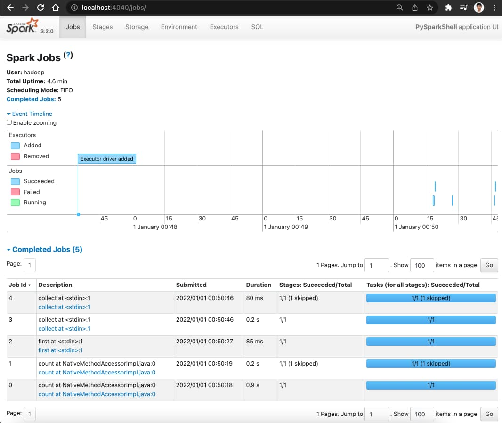

# Quick usage for spark-dev docker image
- Docker build and run
```bash
git clone https://github.com/hibuz/hadoop-docker
cd hadoop-docker/spark

docker compose up --no-build
```

### Attach to running container
```bash
docker exec -it spark bash
```

### Prepare input data
```bash

# prepare input data
hdfs dfs -mkdir -p /user/hadoop
hdfs dfs -put $SPARK_HOME/README.md
```

### Interactive Analysis with the Spark Shell
```bash

~/spark-3.x.x$ spark-shell

Spark context Web UI available at http://74285e639cf8:4040
Spark context available as 'sc' (master = local[*], app id = local-1645883822828).
Spark session available as 'spark'.
Welcome to
      ____              __
     / __/__  ___ _____/ /__
    _\ \/ _ \/ _ `/ __/  '_/
   /___/ .__/\_,_/_/ /_/\_\   version 3.x.x
      /_/
         
Using Scala version 2.12.18 (OpenJDK 64-Bit Server VM, Java 11.0.26)
Type in expressions to have them evaluated.
Type :help for more information.

scala> val textFile = spark.read.textFile("README.md")
textFile: org.apache.spark.sql.Dataset[String] = [value: string]

scala> val wordCounts = textFile.flatMap(line => line.split(" ")).groupByKey(identity).count()
wordCounts: org.apache.spark.sql.Dataset[(String, Long)] = [key: string, count(1): bigint]

scala> wordCounts.collect()
res0: Array[(String, Long)] = Array(([![PySpark,1), (online,1), (graphs,1)...

scala> :q
```

### Interactive Analysis with the PySpark
```bash

~/spark-3.x.x$ pyspark

Welcome to
      ____              __
     / __/__  ___ _____/ /__
    _\ \/ _ \/ _ `/ __/  '_/
   /__ / .__/\_,_/_/ /_/\_\   version 3.x.x
      /_/

Using Python version 3.10.16 (main, Dec 11 2024 16:24:50)
Spark context Web UI available at http://74285e639cf8:4040
Spark context available as 'sc' (master = local[*], app id = local-1645883920521).
SparkSession available as 'spark'.

# Read text file in the HDFS
>>> textFile = spark.read.text("README.md")

# Number of rows in this DataFrame
>>> textFile.count()
125

# First row in this DataFrame
>>> textFile.first()
Row(value='# Apache Spark')

# Count words in the text file
>>> from pyspark.sql.functions import explode, split
>>> wordCounts = textFile.select(explode(split(textFile.value, "\s+")).alias("word")).groupBy("word").count()
>>> wordCounts.collect()
[Row(word='[![PySpark', count=1), Row(word='online', count=1), Row(word='graphs', count=1)...

>>> quit()
```

### Test WordCount MapReduce
```bash

hadoop jar $HADOOP_HOME/share/hadoop/mapreduce/hadoop-mapreduce-examples-*.jar wordcount ./README.md output2

hdfs dfs -cat output2/* |grep PySpark

[![PySpark      1
```

# Visit spark dashboards
- Master Web UI: http://localhost:8080
- Worker Web UI: http://localhost:8081
- Spark History Server: http://localhost:18080
- Spark Jobs: http://localhost:4040 (spark-shell only)


### Stops containers and removes containers, networks, and volumes created by `up`.
```bash

docker compose down -v

[+] Running 3/3
 ✔ Container spark         Removed
 ✔ Volume spark_spark-vol  Removed
 ✔ Network spark_default   Removed
```

# Reference
- https://spark.apache.org/docs/latest/quick-start.html
