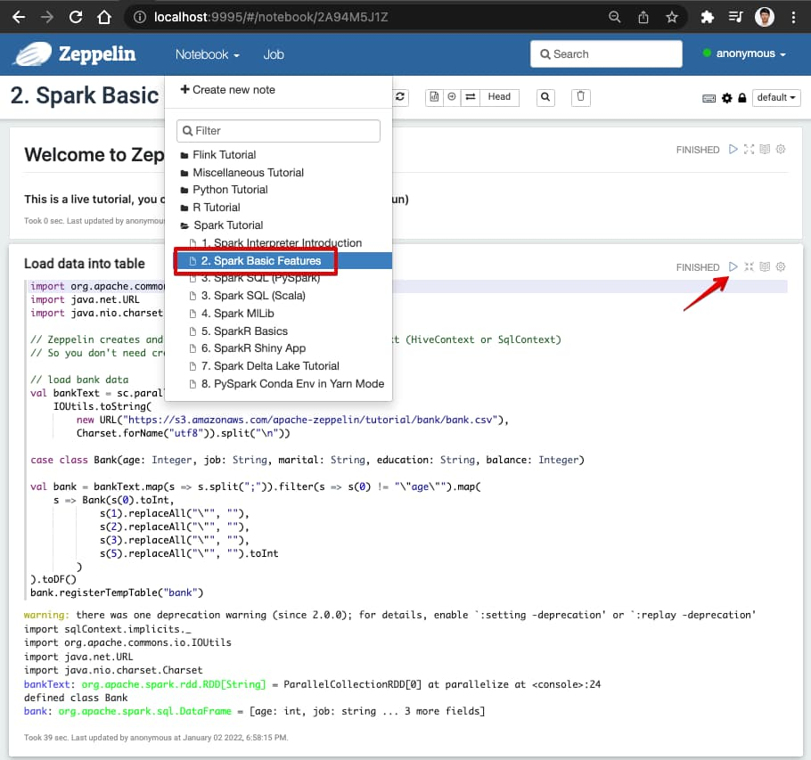

# Quick usage for zeppelin-dev docker image
- Docker build and run
``` bash
git clone https://github.com/hibuz/ubuntu-docker
cd ubuntu-docker/hadoop/zeppelin

docker compose up --no-build
```

### Attach to running container
``` bash
docker exec -it zeppelin bash
```

### Prepare input data
``` bash
# prepare input data
~/zeppelin-0.xx.x$ hdfs dfs -mkdir -p /user/hadoop
~/zeppelin-0.xx.x$ hdfs dfs -put $SPARK_HOME/README.md
```

### Interactive Analysis with the PySpark
``` bash
~/zeppelin-0.xx.x$ pyspark
Welcome to
      ____              __
     / __/__  ___ _____/ /__
    _\ \/ _ \/ _ `/ __/  '_/
   /__ / .__/\_,_/_/ /_/\_\   version 3.x.x
      /_/

Using Python version 3.10.12 (main, Nov 20 2023 15:14:05)
Spark context Web UI available at http://886166433d4e:4040
Spark context available as 'sc' (master = local[*], app id = local-1645887524271).
SparkSession available as 'spark'.

# Read text file in the HDFS
>>> textFile = spark.read.text("README.md")

# Number of rows in this DataFrame
>>> textFile.count()
125

# First row in this DataFrame
>>> textFile.first()
Row(value='# Apache Spark')

# Count words in the text file
>>> from pyspark.sql.functions import explode, split
>>> wordCounts = textFile.select(explode(split(textFile.value, "\s+")).alias("word")).groupBy("word").count()
>>> wordCounts.collect()
[Row(word='[![PySpark', count=1), Row(word='online', count=1), Row(word='graphs', count=1)...

>>> quit()
```

### Interactive Analysis in the Zeppelin Notebook
```python
%spark.pyspark

# Show spark dataframe by reading textfile in the HDFS
textFile = spark.read.text("README.md")
textFile.show()

# Show workd count
from pyspark.sql.functions import explode, split
wordCounts = textFile.select(explode(split(textFile.value, "\s+")).alias("word")).groupBy("word").count()
wordCounts.show()
```

### Collection of useful commands
```bash
# restart daemon
~/zeppelin-0.xx.x$ zeppelin-daemon.sh restart
```

### Tested Tutorials
```python
%sh

## Installation
sudo apt update & sudo apt install wget unzip

pip install matplotlib seaborn bokeh plotnine holoviews hvplot altair vega_datasets plotly
```

- Flink Tutorial
  1. Flink Basics

### Stops containers and removes containers, networks, and volumes created by `up`.
``` bash
docker compose down -v

[+] Running 4/4
 ✔ Container zeppelin-spark-base-1  Removed
 ✔ Container zeppelin               Removed
 ✔ Volume zeppelin_zeppelin-vol     Removed
 ✔ Network zeppelin_default         Removed
```

# Visit zeppelin dashboards

- Zeppelin Tutorials: http://localhost:9995
- Spark Jobs (Optional) : http://localhost:4040
- Flink Dashboard (Optional) : http://localhost:8083

